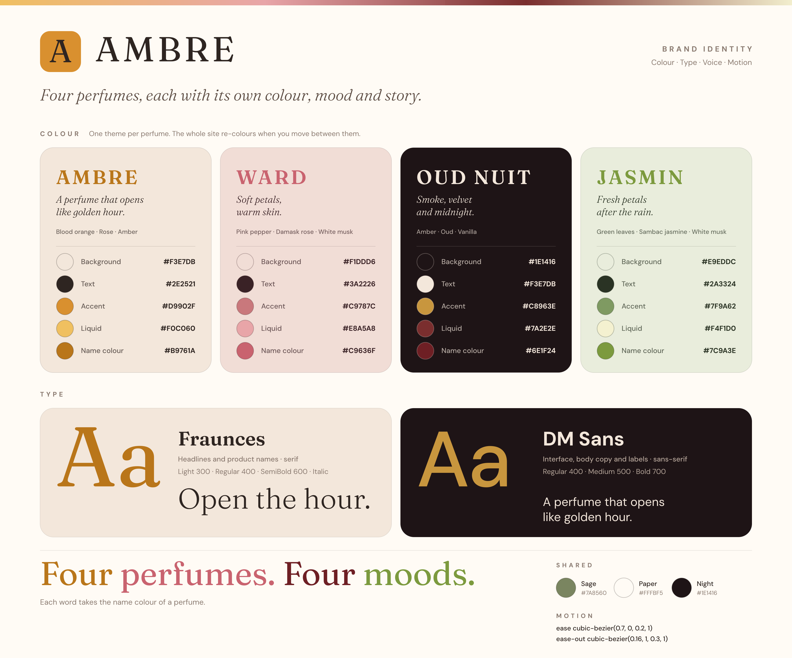
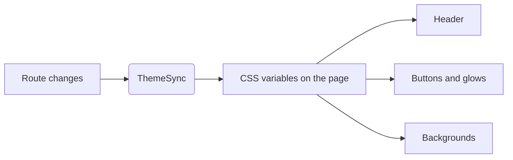
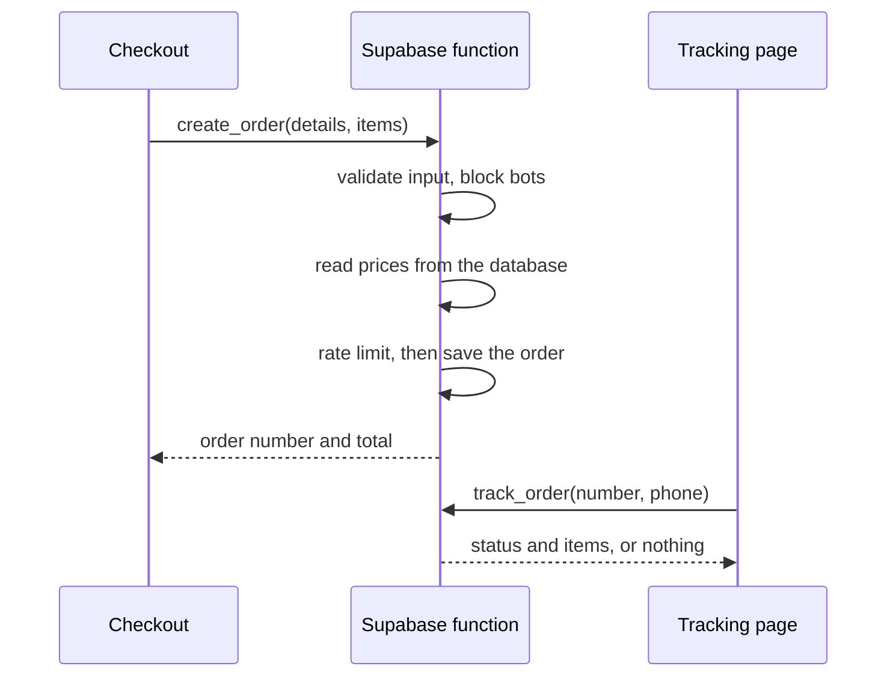

<div align="center">

<h1>AMBRE</h1>

<p><i>Four perfumes, each with its own colour, mood and story.</i></p>

<p><b>A cinematic perfume storefront: a scroll-driven hero, a theme that changes with every perfume, and a secure order pipeline behind it.</b></p>

<p>
  
  
  
  
</p>

<p>
  
  
  
  
  
</p>

<p>
  
  
</p>

<p>
  <a href="#-brand-identity">Brand</a> ·
  <a href="#-screenshots">Screenshots</a> ·
  <a href="#-features">Features</a> ·
  <a href="#-architecture">Architecture</a> ·
  <a href="#-getting-started">Getting Started</a> ·
  <a href="#-roadmap">Roadmap</a>
</p>

</div>

<br />

<!--
  DEMO VIDEO
  Easiest way: open this file in the GitHub editor, drag your .mp4 into it,
  and GitHub inserts a working link. Put that link on its own line here.
  Or commit the file as docs/demo.mp4 and keep the tag below.
-->
<div align="center">
  <video src="docs/demo.mp4" width="100%" controls muted loop playsinline></video>
</div>

<br />

<div align="center">
  
</div>

<br />

<div align="center">
<table>
<tr>
<td width="50%"></td>
<td width="50%"></td>
</tr>
<tr>
<td width="50%"></td>
<td width="50%"></td>
</tr>
</table>
</div>

<br />

## Overview

Most perfume sites show a grid of bottles and call it done. AMBRE treats each perfume as its own world: opening the page plays a scroll-driven film in which the bottle opens, its notes burst out and all four perfumes arrive together, and every perfume then carries its own colour, mood and story through the whole site.

<div align="center">

| Perfume | Mood | Top · Heart · Base |
|:---|:---|:---|
| **AMBRE** | A perfume that opens like golden hour. | Blood orange · Rose · Amber |
| **WARD** | Soft petals, warm skin. | Pink pepper · Damask rose · White musk |
| **OUD NUIT** | Smoke, velvet and midnight. | Amber · Oud · Vanilla |
| **JASMIN** | Fresh petals after the rain. | Green leaves · Sambac jasmine · White musk |

</div>

Behind the visuals it is a working shop: a cart, a checkout that creates real orders, order tracking for customers, and a private admin panel to process them.

<br />

## 🎨 Brand identity

Everything in the interface comes from one small set of tokens, so the site feels like one brand even though it changes colour four times.

<div align="center">
  
</div>

**Colour.** Every perfume defines five values: background, text, accent, liquid and name colour. The theme is written to CSS variables on the page, so the header, buttons, glows and backgrounds all re-colour together when you move between perfumes.

| Token | AMBRE | WARD | OUD NUIT | JASMIN |
|:---|:---:|:---:|:---:|:---:|
| Background | `#F3E7DB` | `#F1DDD6` | `#1E1416` | `#E9EDDC` |
| Text | `#2E2521` | `#3A2226` | `#F3E7DB` | `#2A3324` |
| Accent | `#D9902F` | `#C9787C` | `#C8963E` | `#7F9A62` |
| Liquid | `#F0C060` | `#E8A5A8` | `#7A2E2E` | `#F4F1D0` |
| Name colour | `#B9761A` | `#C9636F` | `#6E1F24` | `#7C9A3E` |

**Typography.**

| Role | Font | Weights |
|:---|:---|:---|
| Headlines and product names | [Fraunces](https://fonts.google.com/specimen/Fraunces) (serif) | 300 · 400 · 600 · italic |
| Interface and body copy | [DM Sans](https://fonts.google.com/specimen/DM+Sans) (sans-serif) | 400 · 500 · 700 |

**Voice.** Short, warm and sensory: *Open the hour.* · *Every hour has its scent.* · *Four perfumes. Four moods.*

**Motion.** Two easing curves are used everywhere: `cubic-bezier(0.7, 0, 0.2, 1)` for transitions and `cubic-bezier(0.16, 1, 0.3, 1)` for arrivals.

<br />

## 📸 Screenshots

<table>
<tr>
<td width="50%"></td>
<td width="50%"></td>
</tr>
<tr>
<td align="center"><sub><b>Scroll-driven cinematic hero</b></sub></td>
<td align="center"><sub><b>The collection</b></sub></td>
</tr>
<tr>
<td width="50%"></td>
<td width="50%"></td>
</tr>
<tr>
<td align="center"><sub><b>Perfume page with interactive spray</b></sub></td>
<td align="center"><sub><b>Checkout</b></sub></td>
</tr>
</table>

<br />

## 🧱 Tech Stack

<table>
<tr>
<td valign="top" width="33%">

**Frontend**
- React · TypeScript · Vite
- React Router
- Zustand (cart, catalog, sound)
- Plain CSS with design tokens

</td>
<td valign="top" width="33%">

**Motion and sound**
- GSAP + ScrollTrigger
- Lenis smooth scrolling
- Framer Motion
- View Transitions API
- Web Audio API

</td>
<td valign="top" width="33%">

**Backend**
- Supabase (Postgres + Auth)
- Row Level Security
- Server-side functions (RPC) for orders and tracking

</td>
</tr>
</table>

<br />

## ✨ Features

- 🎬 **Cinematic hero.** A pinned, scroll-scrubbed sequence: the bottle opens, notes burst out and are named, then all four perfumes arrive and write *Four perfumes. Four moods.*
- 🎨 **A theme per perfume.** Colours, glows and backgrounds change with the perfume you are viewing.
- 🌫️ **Interactive spray.** Tap the bottle and the mist and the sound start on the same beat. Rapid taps layer, and sound can be muted from the header.
- 🧴 **Personalise it.** Choose a size, set the intensity (Eau Fraîche, Eau de Parfum, Extrait), add an engraving or gift wrap.
- 🛍️ **Cart and checkout.** A slide-in bag, validated checkout and cash-on-delivery orders.
- 📦 **Order tracking.** Customers find their order with the order number and phone number together.
- 🔐 **Private admin panel.** Sign in, see orders, open the details and move them through New, Confirmed, Delivered or Cancelled.
- 🌀 **Circular page transitions** using the View Transitions API.
- ♿ **Reduced motion supported.** The heavy animation is skipped for visitors who ask for it.

<br />

## 🏗️ Architecture

**One theme, one source.** Each perfume owns its palette. A small component writes the active palette to CSS variables on the page, so no component needs to know which perfume is showing.



**Orders are created on the server, not trusted from the browser.** The shop never inserts orders directly. It calls a server-side function that re-checks everything and prices the order itself:



**Security model**
- Row Level Security is on for the order tables. Only accounts listed as admins can read or change orders.
- Prices are read from the database when an order is created, so a tampered browser cannot change a total.
- Order creation, order tracking and admin sign-in are rate limited.
- A wrong order number or a wrong phone number both return the same empty answer.

<br />

## 🚀 Getting Started

### Prerequisites

- Node.js 20.19 or newer
- A Supabase project (optional, see below)

### Run it

```bash
git clone https://github.com/omniaalessawy247-hash/perfumes-website.git
cd perfumes-website
npm install
npm run dev
```

The app opens at `http://localhost:5173`.

### Environment variables

Create a `.env` file in the project root:

```env
VITE_SUPABASE_URL=your_project_url
VITE_SUPABASE_PUBLISHABLE_KEY=your_publishable_key
```

The publishable key is meant to be public. Never put a `service_role` key in this project.

> The database schema and security policies are kept outside this repository. Without a backend the storefront still runs, using built-in catalogue prices. Checkout, order tracking and the admin panel need a configured Supabase project.

### Build

```bash
npm run build
npm run preview
```

<br />

## 📁 Project Structure

```
src/
├── components/
│   ├── hero/        Scroll-driven cinematic hero
│   └── home/        Collection, story and gifting sections
├── pages/
│   ├── admin/       Private admin panel
│   └── …            Perfume, checkout, order and tracking pages
├── data/            Perfume catalogue and themes
├── store/           Cart, catalogue and sound state
├── hooks/           Smooth scroll, spray sound, page reveal
└── lib/             API, validation and helpers
```

<br />

## 🗺️ Roadmap

- [ ] Arabic language and right-to-left layout
- [ ] Online payment
- [ ] Lighter hero for low-end phones
- [ ] Manage prices and stock from the admin panel
- [ ] End-to-end tests

<br />

<div align="center">
<sub>Built with React, GSAP and Supabase</sub>
</div>
