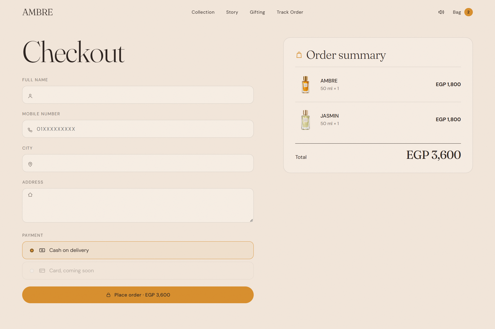
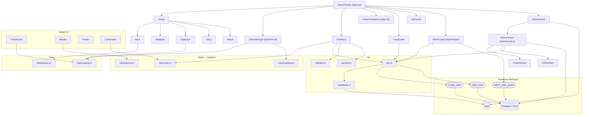

<div align="center">


<br />
<br />

<h1>AMBRE PARFUMS</h1>

<p><b>A luxury perfume storefront with a scroll-driven cinematic front end and a secure, server-side order pipeline.</b></p>

<p>
  
  
  
  
</p>

<p>
  
  
  
</p>

<p>
  <a href="https://perfumes-website-three.vercel.app"><b>Live demo</b></a> ·
  <a href="#-screenshots">Screenshots</a> ·
  <a href="#-architecture">Architecture</a> ·
  <a href="#-features">Features</a> ·
  <a href="#-getting-started">Getting Started</a> ·
  <a href="#-roadmap">Roadmap</a>
</p>

</div>

<br />

## Overview

AMBRE PARFUMS is the digital home of a small perfume house built around four fragrances — **AMBRE**, **WARD**, **OUD NUIT** and **JASMIN** — each with its own colour palette, mood and story. The site presents the brand and its collection through a cinematic, scroll-driven experience: visitors discover each perfume's notes and personality, personalise a bottle, and order it, all inside an interface designed to feel as considered as the product itself.

Pricing and order validation happen entirely on the server. The browser calls Supabase functions to place and track an order — it never inserts a row or sets a price directly, so a tampered client can't change a total.

<br />

## 📸 Screenshots

**A theme per perfume**

<table>
<tr>
<td width="25%"></td>
<td width="25%"></td>
<td width="25%"></td>
<td width="25%"></td>
</tr>
<tr>
<td align="center"><sub><b>AMBRE</b></sub></td>
<td align="center"><sub><b>WARD</b></sub></td>
<td align="center"><sub><b>OUD NUIT</b></sub></td>
<td align="center"><sub><b>JASMIN</b></sub></td>
</tr>
</table>

<table>
<tr>
<td width="50%"></td>
<td width="50%"></td>
</tr>
<tr>
<td align="center"><sub><b>Checkout</b></sub></td>
<td></td>
</tr>
</table>

**Demo video**

<div align="center">
  <video src="https://github.com/user-attachments/assets/c31eba6f-9962-43fe-9fb8-ec71fe18d07f" width="100%" controls muted playsinline></video>
  <br />
  <sub>Video not loading? <a href="https://github.com/user-attachments/assets/c31eba6f-9962-43fe-9fb8-ec71fe18d07f">Open it directly</a>.</sub>
</div>

<br />

## 🎨 Brand Identity

<div align="center">
  
</div>

<br />

Each perfume carries its own background tone across the entire site — the page, the cart drawer and the checkout all shift into it the moment you open that perfume.

| Perfume | Background | Accent | Ink / Text | Liquid |
|:---|:---|:---|:---|:---|
| **AMBRE** | `#F3E7DB` | `#D9902F` | `#2E2521` | `#F0C060` |
| **WARD** | `#F1DDD6` | `#C9787C` | `#3A2226` | `#E8A5A8` |
| **OUD NUIT** | `#1E1416` | `#C8963E` | `#F3E7DB` | `#7A2E2E` |
| **JASMIN** | `#E9EDDC` | `#7F9A62` | `#2A3324` | `#F4F1D0` |

Supporting neutrals used across the shared UI (footer, admin panel, paper surfaces): `#7A8560` (sage), `#FFFBF5` (paper) and `#1E1416` (night).

<br />

## 🧴 Perfume Collection

| Perfume | Mood | Top · Heart · Base |
|:---|:---|:---|
| **AMBRE** | *A perfume that opens like golden hour.* | Blood orange · Rose · Amber |
| **WARD** | *Soft petals, warm skin.* | Pink pepper · Damask rose · White musk |
| **OUD NUIT** | *Smoke, velvet and midnight.* | Amber · Oud · Vanilla |
| **JASMIN** | *Fresh petals after the rain.* | Green leaves · Sambac jasmine · White musk |

Every perfume is offered as an Eau de Parfum in 30, 50 and 100 ml, poured in small batches.

<br />

## 🧱 Tech Stack

<table>
<tr>
<td valign="top" width="50%">

**Frontend**
- React 19 · TypeScript · Vite
- React Router
- GSAP + ScrollTrigger
- Framer Motion
- Lenis (smooth scroll)
- View Transitions API
- Zustand
- Fraunces + DM Sans (Google Fonts)

</td>
<td valign="top" width="50%">

**Backend**
- Supabase — Postgres
- Supabase Auth
- Row Level Security
- RPC functions (`create_order`, `track_order`, `admin_login_guard`)
- Server-side rate limiting

</td>
</tr>
</table>

<br />

## 🏗️ Architecture

Business logic — pricing, validation, rate limiting — lives entirely in Supabase, called through `create_order`, `track_order` and `admin_login_guard`. The browser never writes an order row or a price directly.



<br />

## ✨ Features

- 🎬 Cinematic, pinned scroll sequence for the hero, built with GSAP and ScrollTrigger
- 🎨 A full colour theme (background, text, accent, liquid) that changes per perfume via `ThemeSync`
- 🌬️ Interactive perfume "spray" with sound, synced to the visual mist on every click
- 🔄 Circular, origin-aware page transitions using the View Transitions API
- 🛍️ Persistent shopping bag with a slide-in drawer, tinted to the last perfume added
- 🖊️ Size, intensity, engraving and gift-wrap personalisation per bottle
- 💵 Cash-on-delivery checkout with server-side validation and a honeypot against bots
- 🔎 Order tracking by order number and phone number, with a visual status stepper
- 🔐 Private admin dashboard: revenue and order stats, a 7-day chart, per-perfume sales ranking, a searchable/filterable order table, CSV export, and one-click call/WhatsApp actions
- ♿ Full `prefers-reduced-motion` support throughout the hero, panels and page transitions
- 🧯 Graceful fallback to built-in catalogue prices if the backend is unavailable

<br />

## 🖥️ Website Experience

- **Home** — a single scroll-driven page combining the hero, a scrolling note marquee, the collection, the brand story and a gifting/ritual section.
- **Hero** — a pinned, GSAP-scrubbed cinematic sequence: the bottle opens, its notes burst outward and get labelled (top / heart / base), and the sequence closes on all four perfumes side by side.
- **Perfume page** — a dedicated page per fragrance with an interactive spray stage, size and intensity selection, optional engraving and gift wrap, and the fragrance's own mood photography.
- **Checkout & tracking** — a validated single-page checkout, an order confirmation page, and a separate page to track any order by order number and phone.

<br />

## 🔐 Admin System

The admin area lives at `/admin/*` and is never linked from the public site.

- **AdminLogin** — email/password sign-in against Supabase Auth, guarded by a server-side rate limit.
- **AdminGuard** — wraps `/admin/orders`; checks the Supabase session and redirects to login if there isn't one.
- **AdminOrders** — revenue and order stat cards, a 7-day revenue chart, a per-perfume sales ranking, and a searchable, filterable, sortable order table with CSV export.
- **OrderDrawer** — a detail panel per order, with a status stepper (New → Confirmed → Delivered), a cancel action, and one-click call/WhatsApp links to the customer.

Order rows and status changes are protected by Row Level Security in Supabase — only accounts listed in the `admins` table can read or update them.

<br />

## 🖼️ Assets

Images live under `public/assets/`, organised into subfolders (bottles, ingredients, scenes, brand marks). `setup.mjs` scans these folders for files with a two-digit numeric prefix and generates `src/data/assets.ts`, a lookup map from that number to its file path, consumed throughout the app via the `img()` helper.

<br />

## 🚀 Getting Started

### Prerequisites

- Node.js 20.19+
- A Supabase project (optional — see below)

```bash
git clone https://github.com/omniaalessawy247-hash/perfumes-website.git
cd perfumes-website
npm install
npm run dev
```

The app opens at `http://localhost:5173`.

<br />

### Environment variables

To connect a Supabase backend, create a `.env.local` file in the project root:

```env
VITE_SUPABASE_URL=your_project_url
VITE_SUPABASE_PUBLISHABLE_KEY=your_publishable_key
```

The publishable key is designed to be public. Never put a `service_role` key in this project. Without a configured backend, the storefront still runs using its built-in catalogue prices; checkout, order tracking and the admin panel need Supabase connected.

<br />

### Production build

```bash
npm run build
npm run preview
```

<br />

## 📁 Project Structure

```
.
├── setup.mjs                 Scaffolding script; also generates src/data/assets.ts
├── vercel.json                SPA rewrites for Vercel
├── src/
│   ├── components/             Header, Footer, CartDrawer, ThemeSync, hero/, home/
│   ├── pages/                  Home, PerfumePage, Checkout, TrackOrder, admin/
│   ├── data/                   catalog.ts, assets.ts (generated)
│   ├── store/                  cart.ts, catalog.ts, sound.ts (Zustand)
│   ├── hooks/                  smoothScroll, useRevealNavigate, useSpraySound
│   └── lib/                    api.ts, supabase.ts, validate.ts, format.ts, sanitize.ts
├── public/assets/              Perfume, brand and scene imagery
└── supabase/                   phase2.sql, fix_orders.sql
```

<br />

## 🗺️ Roadmap

- [ ] Arabic language and right-to-left layout
- [ ] Online payment
- [ ] Lighter hero for low-end phones
- [ ] Manage prices and stock from the admin panel
- [ ] End-to-end tests

<br />

## 🤝 Contributing

Contributions, issues, and feature requests are welcome. Feel free to check the [issues page](../../issues).

<br />

<div align="center">
<sub>Built with React and Supabase</sub>
</div>
