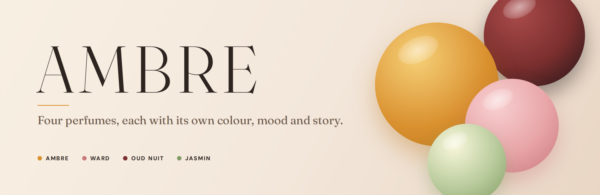
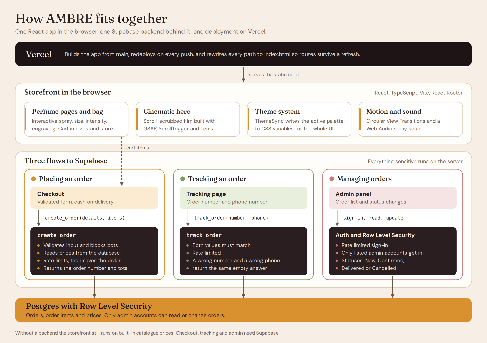

<div align="center">

<a href="https://perfumes-website-three.vercel.app">
  
</a>

<br />
<br />

<p><b>A cinematic perfume storefront with a scroll-driven hero, a theme that changes with every perfume,<br />and a secure order pipeline behind it.</b></p>

<p>
  <a href="https://perfumes-website-three.vercel.app">
    
  </a>
</p>

<p>
  
  
  
  
  
  
  
</p>

<p>
  <a href="#overview">Overview</a> ·
  <a href="#demo">Demo</a> ·
  <a href="#screenshots">Screenshots</a> ·
  <a href="#the-experience">Experience</a> ·
  <a href="#architecture">Architecture</a> ·
  <a href="#brand-identity">Brand</a> ·
  <a href="#getting-started">Getting started</a> ·
  <a href="#deployment">Deployment</a> ·
  <a href="#roadmap">Roadmap</a>
</p>

</div>

<br />

## Overview

Most perfume sites show a grid of bottles and stop there. AMBRE treats each perfume as its own world. Opening the page plays a scroll-driven film in which the bottle opens, its notes burst out, and all four perfumes arrive together. From that point on, every perfume carries its own colour, mood and story through the rest of the site.

<div align="center">

| Perfume | Mood | Top · Heart · Base |
|:---|:---|:---|
| **AMBRE** | A perfume that opens like golden hour. | Blood orange · Rose · Amber |
| **WARD** | Soft petals, warm skin. | Pink pepper · Damask rose · White musk |
| **OUD NUIT** | Smoke, velvet and midnight. | Amber · Oud · Vanilla |
| **JASMIN** | Fresh petals after the rain. | Green leaves · Sambac jasmine · White musk |

</div>

<br />

<table>
<tr>
<td width="33%" valign="top">

**A film, not a hero image**

The landing page is a pinned, scroll-scrubbed sequence built with GSAP and ScrollTrigger. The visitor scrolls and the bottle opens.

</td>
<td width="33%" valign="top">

**One theme per perfume**

Each perfume owns a palette. A single component writes it to CSS variables, so the header, buttons, glows and backgrounds re-colour together.

</td>
<td width="33%" valign="top">

**Orders you can trust**

The browser never writes an order. A server-side function validates the request, reads prices from the database and rate limits the caller.

</td>
</tr>
</table>

Behind the visuals it is a working shop: a cart, a checkout that creates real cash-on-delivery orders, order tracking for customers, and a private admin panel to process them.

<br />

## Demo

**Live site:** [perfumes-website-three.vercel.app](https://perfumes-website-three.vercel.app)

<!--
  Paste the GitHub video link on its own line below this comment.
  To get it: edit this file on GitHub, drag the .mp4 into the editor,
  and GitHub inserts the link.
-->

<br />

## Screenshots

<table>
<tr>
<td width="50%"></td>
<td width="50%"></td>
</tr>
<tr>
<td align="center"><sub><b>AMBRE</b></sub></td>
<td align="center"><sub><b>WARD</b></sub></td>
</tr>
<tr>
<td width="50%"></td>
<td width="50%"></td>
</tr>
<tr>
<td align="center"><sub><b>OUD NUIT</b></sub></td>
<td align="center"><sub><b>JASMIN</b></sub></td>
</tr>
</table>

<div align="center">
  
  <br /><sub><b>Checkout</b></sub>
</div>

<br />

## The experience

| Stage | What happens |
|:---|:---|
| **Hero** | A pinned, scroll-scrubbed film. The bottle opens, notes burst out and are named, then all four perfumes arrive and write *Four perfumes. Four moods.* |
| **Collection** | The four perfumes, each previewed in its own colours. Moving between them re-colours the whole interface, and pages change with a circular View Transition. |
| **Perfume page** | Tap the bottle to spray. The mist and the sound start on the same beat, rapid taps layer, and sound can be muted from the header. |
| **Personalise** | Choose a size, set the intensity (Eau Fraîche, Eau de Parfum or Extrait), and add an engraving or gift wrap. |
| **Bag and checkout** | A slide-in bag, a validated checkout and cash-on-delivery orders. |
| **Tracking** | Customers look up an order with the order number and phone number together. |
| **Admin** | The owner signs in, sees every order, opens the details and moves it through New, Confirmed, Delivered or Cancelled. |

Visitors who prefer reduced motion get the site without the heavy animation.

<br />

## Architecture

<div align="center">
  
</div>

<br />

**How an order travels**

1. Checkout sends the customer details and the cart items to the `create_order` function.
2. The function validates the input and blocks bots.
3. It reads every price from the database. A total computed in the browser is never trusted.
4. It applies the rate limit, saves the order and returns the order number and total.
5. Later, the tracking page calls `track_order` with the order number and phone number. If either is wrong, nothing comes back.

**Security model**

- Row Level Security is enabled on the order tables. Only accounts listed as admins can read or change orders.
- Prices are read from the database when an order is created, so a tampered browser cannot change a total.
- Order creation, order tracking and admin sign-in are rate limited.
- A wrong order number and a wrong phone number return the same empty answer, so neither can be probed on its own.

**One theme, one source.** Each perfume owns its palette. A small component, `ThemeSync`, writes the active palette to CSS variables whenever the route changes. No other component needs to know which perfume is showing.

<br />

## Brand identity

Everything in the interface comes from one small set of tokens, so the site reads as one brand even though it changes colour four times.

<div align="center">
  
</div>

<br />

**Colour.** Every perfume defines five values: background, text, accent, liquid and name colour.

| Token | AMBRE | WARD | OUD NUIT | JASMIN |
|:---|:---:|:---:|:---:|:---:|
| Background | `#F3E7DB` | `#F1DDD6` | `#1E1416` | `#E9EDDC` |
| Text | `#2E2521` | `#3A2226` | `#F3E7DB` | `#2A3324` |
| Accent | `#D9902F` | `#C9787C` | `#C8963E` | `#7F9A62` |
| Liquid | `#F0C060` | `#E8A5A8` | `#7A2E2E` | `#F4F1D0` |
| Name colour | `#B9761A` | `#C9636F` | `#6E1F24` | `#7C9A3E` |

**Typography.**

| Role | Font | Weights |
|:---|:---|:---|
| Headlines and product names | [Fraunces](https://fonts.google.com/specimen/Fraunces) (serif) | 300 · 400 · 600 · italic |
| Interface and body copy | [DM Sans](https://fonts.google.com/specimen/DM+Sans) (sans-serif) | 400 · 500 · 700 |

**Voice.** Short, warm and sensory: *Open the hour.* · *Every hour has its scent.* · *Four perfumes. Four moods.*

**Motion.** Two easing curves are used throughout: `cubic-bezier(0.7, 0, 0.2, 1)` for transitions and `cubic-bezier(0.16, 1, 0.3, 1)` for arrivals.

<br />

## Tech stack

<table>
<tr>
<td valign="top" width="25%">

**Frontend**
- React, TypeScript, Vite
- React Router
- Zustand (cart, catalogue, sound)
- Plain CSS with design tokens

</td>
<td valign="top" width="25%">

**Motion and sound**
- GSAP and ScrollTrigger
- Lenis smooth scrolling
- Framer Motion
- View Transitions API
- Web Audio API

</td>
<td valign="top" width="25%">

**Backend**
- Supabase (Postgres and Auth)
- Row Level Security
- Server-side functions (RPC) for orders and tracking

</td>
<td valign="top" width="25%">

**Hosting**
- Vercel
- Static build with SPA rewrites

</td>
</tr>
</table>

<br />

## Getting started

### Prerequisites

- Node.js 20.19 or newer
- A Supabase project (optional, see the note below)

### Run locally

```bash
git clone https://github.com/omniaalessawy247-hash/perfumes-website.git
cd perfumes-website
npm install
npm run dev
```

The app opens at `http://localhost:5173`.

### Environment variables

Create a `.env.local` file in the project root:

```env
VITE_SUPABASE_URL=your_project_url
VITE_SUPABASE_PUBLISHABLE_KEY=your_publishable_key
```

The publishable key is designed to be public. Never put a `service_role` key in this project.

> The database schema and security policies are kept outside this repository. Without a backend the storefront still runs, using built-in catalogue prices. Checkout, order tracking and the admin panel need a configured Supabase project.

### Build

```bash
npm run build
npm run preview
```

<br />

## Deployment

The site is deployed on Vercel from the `main` branch, and every push redeploys it.

1. Import the repository in Vercel. The Vite preset is detected automatically (build command `npm run build`, output directory `dist`).
2. Add `VITE_SUPABASE_URL` and `VITE_SUPABASE_PUBLISHABLE_KEY` under **Environment Variables**. Vite bakes these into the bundle at build time, so redeploy after changing them.
3. Keep `vercel.json` in the project root. It rewrites every path to `index.html`, so routes such as `/admin` and the tracking page load directly and survive a refresh.
4. In Supabase, open **Authentication > URL Configuration** and add the Vercel URL to **Site URL** and **Redirect URLs** so admin sign-in works in production. Keep `http://localhost:5173` in the list for local development.

<br />

## Project structure

```
.
├── src/
│   ├── assets/        Static assets
│   ├── components/
│   │   ├── hero/      Scroll-driven cinematic hero
│   │   └── home/      Collection, story and gifting sections
│   ├── pages/
│   │   ├── admin/     Private admin panel
│   │   └── ...        Perfume, checkout, order and tracking pages
│   ├── data/          Perfume catalogue and themes
│   ├── store/         Cart, catalogue and sound state
│   ├── hooks/         Smooth scroll, spray sound, page reveal
│   └── lib/           API, validation and helpers
├── public/            Files served as-is
├── docs/              Screenshots, brand board and architecture diagram
└── vercel.json        SPA rewrites for Vercel
```

<br />

## Roadmap

- [ ] Arabic language and right-to-left layout
- [ ] Online payment
- [ ] Lighter hero for low-end phones
- [ ] Manage prices and stock from the admin panel
- [ ] End-to-end tests

<br />

<div align="center">
<sub>Built with React, GSAP and Supabase</sub>
</div>
