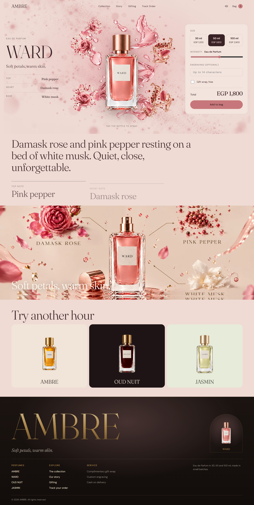
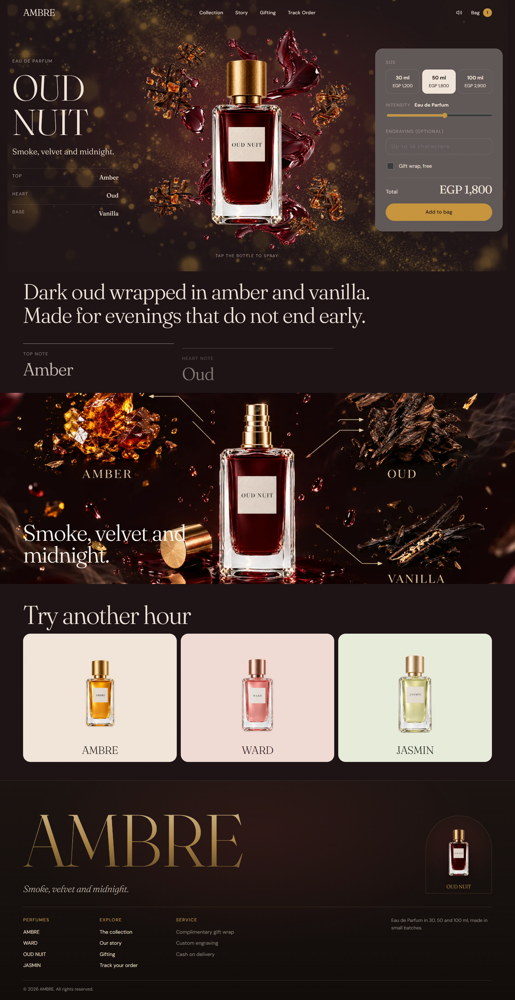
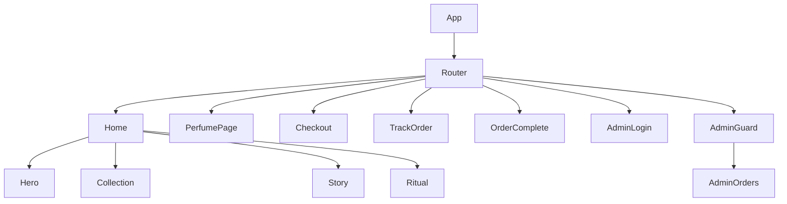
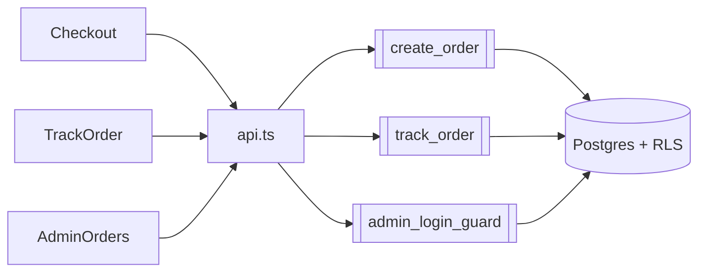

<div align="center">


<br />
<br />

<h1>AMBRE PARFUMS</h1>

<p><b>A luxury perfume storefront with a scroll-driven cinematic front end and a secure, server-side order pipeline.</b></p>

<p>
  
  
  
  
</p>

<p>
  <a href="https://perfumes-website-three.vercel.app"><b>Live demo</b></a> ·
  <a href="#screenshots">Screenshots</a> ·
  <a href="#architecture">Architecture</a> ·
  <a href="#features">Features</a> ·
  <a href="#getting-started">Getting Started</a>
</p>

</div>

<br />

## Overview

AMBRE PARFUMS is the digital home of a small perfume house built around four fragrances — **AMBRE**, **WARD**, **OUD NUIT** and **JASMIN** — each with its own colour palette, mood and story. The site presents the brand and its collection through a cinematic, scroll-driven experience, and includes a full order pipeline: checkout, order tracking, and a private admin panel.

Pricing and order validation happen entirely on the server. The browser calls Supabase functions to place and track an order — it never inserts a row or sets a price directly.

<br />

## Demo Video

<div align="center">
  <video src="https://github.com/user-attachments/assets/c31eba6f-9962-43fe-9fb8-ec71fe18d07f" width="100%" controls muted playsinline></video>
  <br />
  <sub>Video not loading? <a href="https://github.com/user-attachments/assets/c31eba6f-9962-43fe-9fb8-ec71fe18d07f">Open it directly</a>.</sub>
</div>

<br />

## Screenshots

<table>
<tr>
<td width="25%"></td>
<td width="25%"></td>
<td width="25%"></td>
<td width="25%"></td>
</tr>
<tr>
<td align="center"><sub><b>AMBRE</b></sub></td>
<td align="center"><sub><b>WARD</b></sub></td>
<td align="center"><sub><b>OUD NUIT</b></sub></td>
<td align="center"><sub><b>JASMIN</b></sub></td>
</tr>
</table>

<br />

## Brand Colors

Each perfume carries its own background tone across the entire site — the page, the cart drawer and the checkout all shift into it via `ThemeSync`.

| Perfume | Background | Accent | Ink / Text | Liquid |
|:---|:---|:---|:---|:---|
| **AMBRE** | `#F3E7DB` | `#D9902F` | `#2E2521` | `#F0C060` |
| **WARD** | `#F1DDD6` | `#C9787C` | `#3A2226` | `#E8A5A8` |
| **OUD NUIT** | `#1E1416` | `#C8963E` | `#F3E7DB` | `#7A2E2E` |
| **JASMIN** | `#E9EDDC` | `#7F9A62` | `#2A3324` | `#F4F1D0` |

<br />

## Perfume Collection

| Perfume | Mood | Top · Heart · Base |
|:---|:---|:---|
| **AMBRE** | A perfume that opens like golden hour. | Blood orange · Rose · Amber |
| **WARD** | Soft petals, warm skin. | Pink pepper · Damask rose · White musk |
| **OUD NUIT** | Smoke, velvet and midnight. | Amber · Oud · Vanilla |
| **JASMIN** | Fresh petals after the rain. | Green leaves · Sambac jasmine · White musk |

Each is offered as an Eau de Parfum in 30, 50 and 100 ml.

<br />

## Tech Stack

<table>
<tr>
<td valign="top" width="50%">

**Frontend**
- React · TypeScript · Vite
- React Router
- GSAP + ScrollTrigger
- Framer Motion
- Lenis (smooth scroll)
- View Transitions API
- Zustand
- Fraunces + DM Sans (Google Fonts)

</td>
<td valign="top" width="50%">

**Backend**
- Supabase — Postgres
- Supabase Auth
- Row Level Security
- RPC functions: `create_order`, `track_order`, `admin_login_guard`
- Server-side rate limiting

</td>
</tr>
</table>

<br />

## Architecture

**1. Routing and pages** — `App.tsx` mounts the router. `Home` combines the hero and the collection/story/ritual sections; the admin routes sit behind `AdminGuard` and are never linked from the public UI.



**2. Data and order flow** — Every write goes through `lib/api.ts`, which calls Supabase RPC functions instead of writing to tables directly. Prices are read and validated server-side, and admin data is restricted by Row Level Security.



<br />

## Features

- Pinned, scroll-scrubbed cinematic hero built with GSAP and ScrollTrigger
- Full colour theme per perfume, synced across the site by `ThemeSync`
- Interactive perfume "spray" with sound, synced to the visual mist on click
- Circular, origin-aware page transitions using the View Transitions API
- Persistent shopping bag with a slide-in drawer, themed to the last perfume added
- Size, intensity, engraving and gift-wrap personalisation per bottle
- Cash-on-delivery checkout with server-side validation and a honeypot against bots
- Order tracking by order number and phone number, with a status stepper
- Admin dashboard: revenue stats, a 7-day chart, per-perfume sales ranking, a filterable order table, CSV export, and call/WhatsApp shortcuts
- `prefers-reduced-motion` support throughout the hero, panels and transitions
- Falls back to built-in catalogue prices when Supabase isn't configured

<br />

## Admin System

The admin area lives at `/admin/*` and is never linked from the public site.

- **AdminLogin** — sign-in against Supabase Auth, guarded by a server-side rate limit
- **AdminGuard** — checks the Supabase session and redirects to login if there isn't one
- **AdminOrders** — stats, a 7-day revenue chart, per-perfume ranking, and a searchable/filterable order table with CSV export
- **OrderDrawer** — order detail, status stepper (New → Confirmed → Delivered), cancel action, and call/WhatsApp links

Order rows and status changes are protected by Row Level Security — only accounts listed in the `admins` table can read or update them.

<br />

## Getting Started

**Prerequisites:** Node.js 20.19+. A Supabase project is optional.

```bash
git clone https://github.com/omniaalessawy247-hash/perfumes-website.git
cd perfumes-website
npm install
npm run dev
```

The app opens at `http://localhost:5173`.

To connect a Supabase backend, create `.env.local`:

```env
VITE_SUPABASE_URL=your_project_url
VITE_SUPABASE_PUBLISHABLE_KEY=your_publishable_key
```

Never put a `service_role` key in this project. Without a configured backend, the storefront still runs on built-in catalogue prices; checkout, tracking and admin need Supabase connected.

```bash
npm run build
npm run preview
```

<br />

## Project Structure

```
.
├── setup.mjs                 Scaffolding script; also generates src/data/assets.ts
├── vercel.json                SPA rewrites for Vercel
├── src/
│   ├── components/             Header, Footer, CartDrawer, ThemeSync, hero/, home/
│   ├── pages/                  Home, PerfumePage, Checkout, TrackOrder, admin/
│   ├── data/                   catalog.ts, assets.ts (generated)
│   ├── store/                  cart.ts, catalog.ts, sound.ts (Zustand)
│   ├── hooks/                  smoothScroll, useRevealNavigate, useSpraySound
│   └── lib/                    api.ts, supabase.ts, validate.ts, format.ts, sanitize.ts
├── public/assets/              Perfume, brand and scene imagery
├── docs/                       Screenshots and brand identity
└── supabase/                   phase2.sql, fix_orders.sql
```
