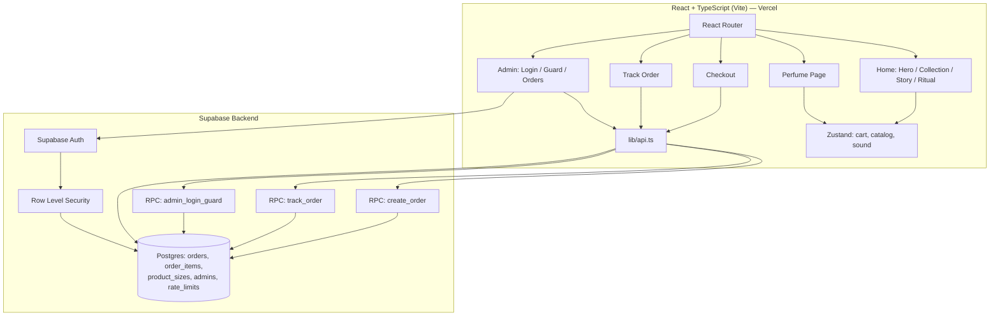

<div align="center">

# AMBRE PARFUMS

*Luxury Perfume Website — Four perfumes, each with its own colour, mood and story.*


</div>

<br />

## Project Overview

AMBRE PARFUMS is a luxury perfume storefront built to showcase a brand and its collection through a cinematic, scroll-driven browsing experience. The site presents four perfumes — **AMBRE**, **WARD**, **OUD NUIT** and **JASMIN** — each with its own colour theme, notes and story, alongside an interactive bottle-spray experience, a full ordering flow (cash on delivery), order tracking, and a private admin panel for managing orders.

<br />

## Brand / Visual Identity

<p align="center">
  
</p>

Each perfume carries a distinct visual identity across the entire site — background, text, accent, liquid and name colours — kept in sync by a `ThemeSync` component that writes the active palette to CSS variables on every route change. Typography pairs **Fraunces** (serif) for display type with **DM Sans** for body text.

<br />

## Perfume Collection

| Perfume | Tagline | Top · Heart · Base |
|:---|:---|:---|
| **AMBRE** | A perfume that opens like golden hour. | Blood orange · Rose · Amber |
| **WARD** | Soft petals, warm skin. | Pink pepper · Damask rose · White musk |
| **OUD NUIT** | Smoke, velvet and midnight. | Amber · Oud · Vanilla |
| **JASMIN** | Fresh petals after the rain. | Green leaves · Sambac jasmine · White musk |

Each perfume is available in **30 ml, 50 ml and 100 ml** sizes.

<br />

## Main Features

- **Cinematic hero** — a pinned, scroll-scrubbed sequence (GSAP + ScrollTrigger) where the bottle opens, ingredient notes burst out, and the four perfumes are revealed together at the end
- **Per-perfume theming** — colours, product pages and the cart drawer all adapt to the selected perfume's palette
- **Interactive spray** — tapping a bottle on its product page triggers a mist animation synced with a Web Audio spray sound
- **Circular page transitions** — using the View Transitions API, with `prefers-reduced-motion` respected throughout
- **Shopping bag** — size, intensity, custom engraving (up to 14 characters) and gift-wrap options, with a slide-in cart drawer
- **Checkout** — validated form, cash-on-delivery payment, bot protection via a honeypot field
- **Order tracking** — customers look up an order by order number and phone number together
- **Admin panel** — private sign-in, order list with filtering/search/sorting, CSV export, and order status management

<br />

## Pages

| Route | Page |
|:---|:---|
| `/` | Home — hero, collection, story and gifting sections |
| `/perfume/:id` | Individual perfume product page |
| `/checkout` | Checkout and order form |
| `/order/:id` | Order confirmation |
| `/track-order` | Order tracking |
| `/admin/login` | Admin sign-in (not linked in the public UI) |
| `/admin/orders` | Admin order dashboard (guarded) |
| `*` | 404 Not Found |

<br />

## System Architecture



Business logic lives entirely in Supabase (Postgres, Auth, server-side RPC functions) — there is no custom application server. Order creation and status reads go through `create_order` and `track_order`, which validate input, re-price every item from the database, and are rate-limited, so a tampered client can never set its own price. Order data is protected by Row Level Security, readable and writable only by accounts listed in the `admins` table.

<br />

## Project Structure

```
.
├── src/
│   ├── components/
│   │   ├── hero/          Scroll-driven cinematic hero (Hero.tsx, swarm.ts)
│   │   ├── home/           Collection, Story, Ritual, Marquee sections
│   │   ├── Header.tsx, Footer.tsx, CartDrawer.tsx, ThemeSync.tsx, icons.tsx
│   ├── pages/
│   │   ├── admin/          AdminLogin, AdminGuard, AdminShell, AdminOrders, OrderDrawer
│   │   ├── Home.tsx, PerfumePage.tsx, Checkout.tsx, OrderComplete.tsx,
│   │   │   TrackOrder.tsx, NotFound.tsx
│   ├── data/
│   │   ├── catalog.ts       Perfume catalogue: names, notes, themes, sizes
│   │   └── assets.ts        Generated image-id → path map
│   ├── store/               Zustand: cart.ts, catalog.ts, sound.ts
│   ├── hooks/                smoothScroll.ts, useRevealNavigate.ts, useSpraySound.ts
│   └── lib/                  api.ts (Supabase calls), supabase.ts, validate.ts,
│                              sanitize.ts, format.ts
├── supabase/
│   ├── phase2.sql            Order numbers, RLS policies, rate limiting, RPC functions
│   └── fix_orders.sql        Schema/order-flow repair script
├── public/
│   └── assets/                Static images, including Identity Board.png
└── setup.mjs                  Project scaffolding script
```

<br />

## Technology Stack

| Layer | Tools |
|:---|:---|
| Frontend | React, TypeScript, Vite, React Router |
| Motion & sound | GSAP, ScrollTrigger, Lenis (smooth scroll), Framer Motion, View Transitions API, Web Audio API |
| State | Zustand (cart, catalog, sound — with `persist` for cart/sound) |
| Backend | Supabase (Postgres, Auth, Row Level Security, RPC functions) |
| Hosting | Vercel |

<br />

## UI/UX

- **Theme-per-perfume**: five CSS custom properties (background, text, accent, liquid, on-accent) recalculated on every route via `ThemeSync`
- **Smooth scrolling** with Lenis, synced to GSAP's ScrollTrigger
- **Reduced motion support**: heavy animation sequences are skipped via `prefers-reduced-motion`
- **Responsive layouts** across the hero, product stage, checkout and admin dashboard, with dedicated mobile breakpoints throughout
- **Accessible forms**: labelled fields, `aria-live` error messaging, and honeypot-based bot protection on checkout and tracking forms

<br />

## Admin System

- **Private sign-in** (`/admin/login`) via Supabase Auth, rate-limited through the `admin_login_guard` RPC, not linked anywhere in the public UI
- **Route guarding** (`AdminGuard`) redirects unauthenticated visitors to the login page
- **Order dashboard** (`AdminOrders`) — revenue and order stats, a 7-day activity chart, per-perfume unit ranking, search, status filters, sorting, pagination and CSV export
- **Order drawer** (`OrderDrawer`) — full order detail, a status stepper (New → Confirmed → Delivered), cancel/restore, and one-tap call/WhatsApp contact
- **Status management**: orders move between **New**, **Confirmed**, **Delivered** and **Cancelled**, enforced by a database check constraint and restricted to admin accounts by Row Level Security

<br />

## Installation / Run

**Prerequisites:** Node.js 20.19 or newer. A Supabase project is optional — see the note below.

```bash
git clone https://github.com/omniaalessawy247-hash/perfumes-website.git
cd perfumes-website
npm install
npm run dev
```

The app opens at `http://localhost:5173`.

Create a `.env.local` file in the project root:

```env
VITE_SUPABASE_URL=your_project_url
VITE_SUPABASE_PUBLISHABLE_KEY=your_publishable_key
```

> The publishable key is designed to be public. Never put a `service_role` key in this project.
> Without a configured backend the storefront still runs, using built-in catalogue prices. Checkout, order tracking and the admin panel need a configured Supabase project (see `supabase/phase2.sql`).

To create a production build:

```bash
npm run build
npm run preview
```
